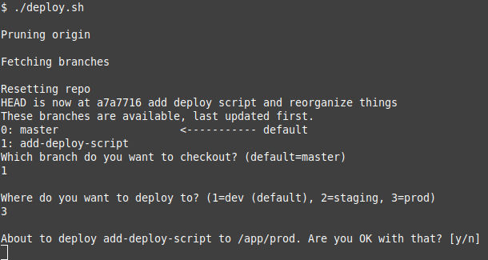

# Usage
Just run `./deploy.sh` and answer the questions.

Branches will be listed, most recently updated first and prefixed with a number.
Simply type the number to select a branch and hit Enter.

Here's what it looks like when run on this repo:

